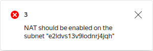
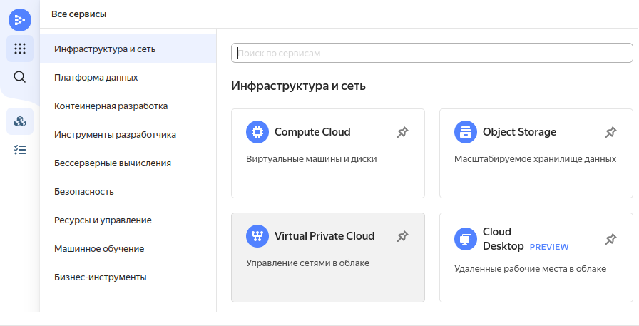
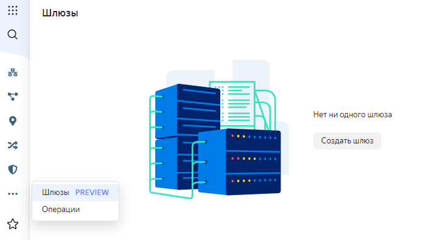
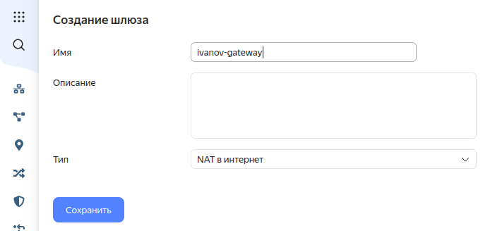
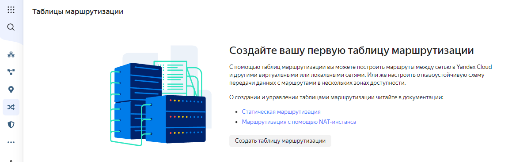
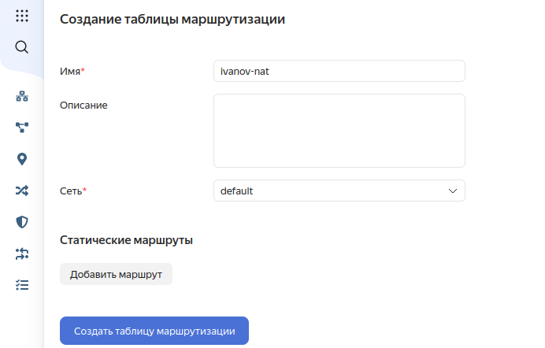
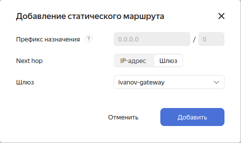
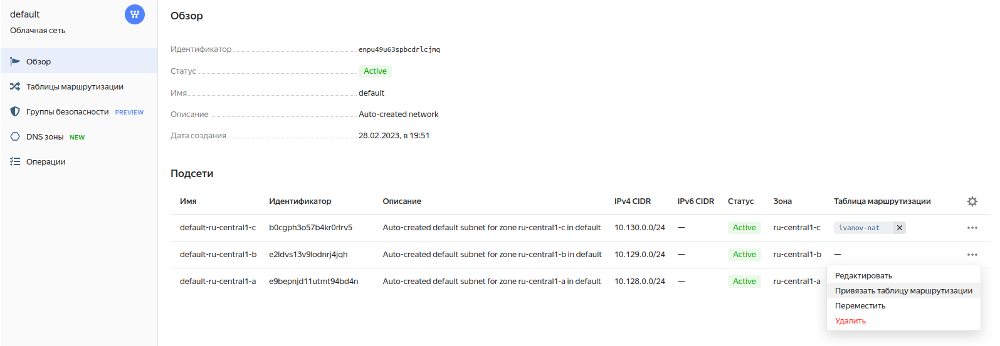

## Создание NAT-шлюза
Данная инструкция актуальна, если при создании кластера выполучили ошибку вида

1. В сервисе "Инфраструктура и сети" выберите раздел "Управление сетями в облаке"

2. Выберите секцию "Шлюзы" и нажмите кнопку "Создать шлюз"

3. Задайте имя и сохраните шлюз

4. Перейдите в секцию "Таблицы маршрутизации" нажмите кнопку "Создать таблицу маршрутизации"

5. Задайте имя таблицы, выберите сеть (по умолчанию default) и нажмите кнопку "Добавить маршрут"

6. Задайте параметры статического маршрута (0.0.0.0/0) и выберите шлюз из пункта 3, после чего сохраните таблицу.

7. Вернитесь в раздел "Управление сетями в облаке", выберите вашу сеть (по умолчанию default). Для каждой подсети привяжите таблицу маршрутизации

