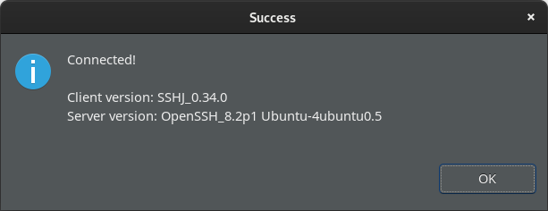

# Практическое задание Apache Hive

## Создание кластера
* Создайте кластер аналогично как в практике №1 (**не забудьте при создании поставить галочку Hive в списке компонент**)

## Подключение
### SSH
* Выбираем любой сервер кластера (лучше не NameNode), нажимаем на ссылку
* В разделе `Обзор` -> `Сеть` нажимаем на троеточие (`...`) и выбираем `Добавить публичный адрес` 
* Через несколько секунд появится пбличный адрес, по которому можно будет подключиться к серверу по ssh
* В консоли набираем `ssh ubuntu@158.160.2.78`, на запрос подтверждения соединения набираем `yes`

```shell
ssh ubuntu@158.160.2.78
The authenticity of host '158.160.2.78 (158.160.2.78)' can't be established.
ED25519 key fingerprint is SHA256:FZgdcMF5nf9WkjU0trSkGq30aM7HZZnltBmnyKMrPAI.
This key is not known by any other names.
Are you sure you want to continue connecting (yes/no/[fingerprint])? yes
Warning: Permanently added '158.160.2.78' (ED25519) to the list of known hosts.
Welcome to Ubuntu 20.04.5 LTS (GNU/Linux 5.4.0-135-generic x86_64)

 * Documentation:  https://help.ubuntu.com
 * Management:     https://landscape.canonical.com
 * Support:        https://ubuntu.com/advantage
```
* мы попали в терминал удаленного сервера, там набираем команду `hive`
* После того, как будет выведен лог запуска, вы можете выполнять запросы

### DBeaver
Для использования графического инструмента можно воспользоваться [DBeaver](https://dbeaver.io/)
#### Настройка подключения:
К сожалению, ЯО ставить Hive Server на NameNode. Поэтому подключаться будем к ней.
* Добавьте публичный адрес для NameNode
* Скачайте и установите DBeaver
* Запускам ,нажимаем добавить новое соединение (Database -> New database connection)
* В строке поиска набираем Hive, выбираем


* Переходим в раздел `SSH`


* Добавляем новый профиль (синий карандаш). Выбираем `New`, называем наш новый профиль.


* Выбираем галочку `Use SSH Tunnel`
* Заполняем IP адрес значением публичного адреса для NameNode
* Пользователь - `ubuntu`
* Authorization method - `Public key`
* Указываем адрес до приватной части ключа


* Нажимаем `Test connection`если все хорошо увидите скриншот ниже, не забываем выбрать созданный профиль в окошке `Profile`


* Возвращаемся на вкладку `Main`


* Проверяем соединение - нажимаем `Test connection`. Если все хорошо - будет окно скачивания драйверов


* После этого в навигаторе появится новое соединение. Нажимаем правой кнопкой - `SQL editor` -> `Open SQL script` (или `F3`)
* Набираем `select version();`, выполняем запрос.
