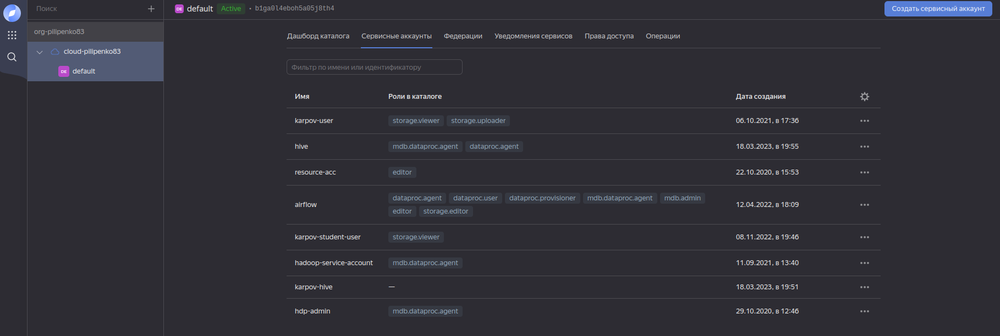
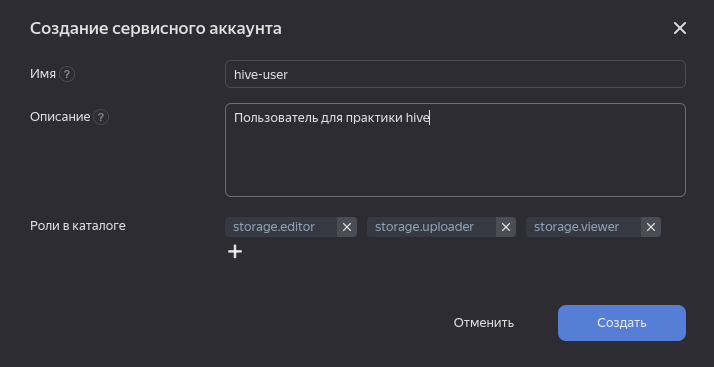
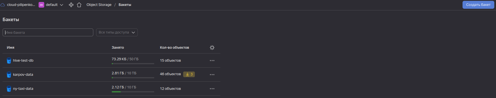
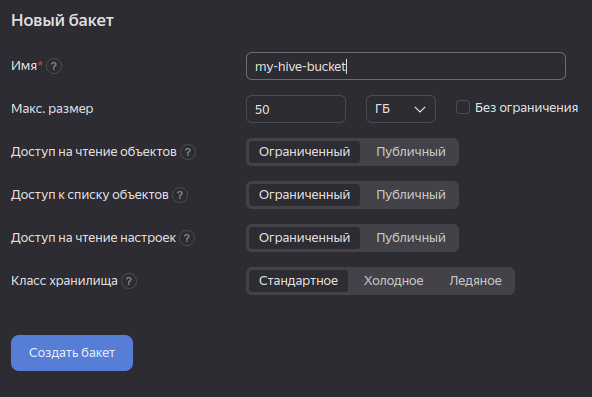
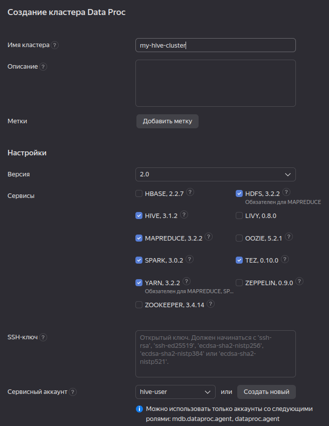

# Инструкции по работе с S3
## Создание сервисного аккаунта
1. заходим на домашнюю страницу каталога

2. Нажимаем кнопку `Создать сервисный аккаунт`

3. Даем имя (в моем случае `hive-user`), при необходимости доавляем описание, назначем роли:
    * `storage.editor`
    * `storage.uploader` 
    * `storage.viewer`
    * `dataproc.agent` (для возможности создания Data Proc кластера)
    * `mdb.dataproc.agent` (достаточно и предыдущей, но в ЯО часто что-то меняется, так что на будущее добавим обе)

4. Возвращаемся на домашнюю страницу каталога, заходим в раздел `Object storage`, нажимаем `Создать бакет`

5. Называем бакет, меняем размер бакета (по необходимости), подтверждаем создание

6. Возвращаемся на домашнюю страниц каталога, переходим в раздел `Data Proc` и создаем кластер 

Тут важно
   * выбрать в меню `Сервисный аккаунт` наш новый созданный аккаунт
   * выбрать `Hive` в списке устанавливаемых компонент

После этого можно создавать таблицы с `location` в S3.
